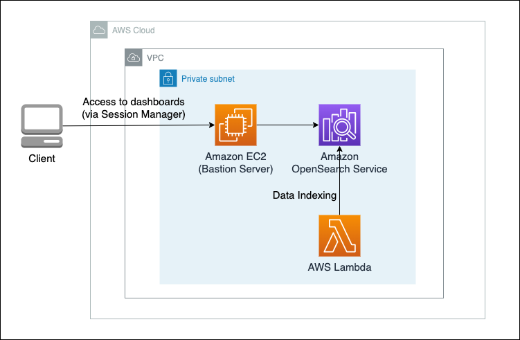
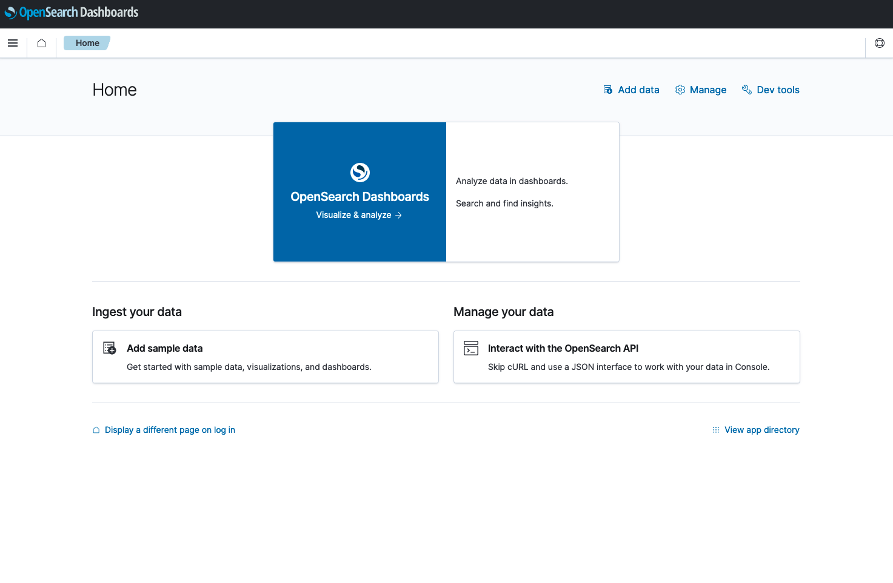

# OpenSearch in VPC with CDK

## Overview

This is a sample implementation for Amazon OpenSearch Service deployed in VPC with CDK (TypeScript). In this sample, all resources are deployed in private subnet, and end users have access to the OpenSearch Dashboards via port forwading in AWS Session Manager, avoiding need for exposing SSH port to the internet. This sample also contains indexing data into OpenSearch from AWS Lambda deployed in VPC.



## Pre-requisites

- Configuration of AWS profile
- Node.js (Active LTS version preferred)
- Docker
  - Docker is used to create packages for Lambda function.
- [Session Manager Plugin](https://docs.aws.amazon.com/systems-manager/latest/userguide/session-manager-working-with-install-plugin.html)
  - Session Manager Plugin is required for access to OpenSearch Dashboards using Session Manager.

## Getting started

### 1. Deployment

Run the following commands to deploy the sample in this directory.

```sh
npm ci
npx cdk bootstrap
npx cdk deploy
```

Initial deployment usually takes about 20 to 30 minutes. You can also use `npx cdk deploy` command to modify deployed resources. If the deployment completes successfully, you will get outputs like below. Outputs values will be used in the following steps.

```
 ✅  OpensearchVpcCdkStack

✨  Deployment time: 1521.61s

Outputs:
OpensearchVpcCdkStack.BastionHostBastionHostIdC743CBD6 = i-xxxxxxxx
OpensearchVpcCdkStack.IndexingFunctionName = OpensearchVpcCdkStack-DataIndexxxxxxx
OpensearchVpcCdkStack.OpenSearchDomainHost = vpc-domainxxxxxxxxxx.ap-northeast-1.es.amazonaws.com
Stack ARN:
arn:aws:cloudformation:ap-northeast-1:123456789012:stack/OpensearchVpcCdkStack/078d0be0-e3c5-11ed-8d9c-0a455fdf670f

✨  Total time: 1543.55s
```

### 2. (Optional) Indexing sample data

You can run this lambda to index sample data to OpenSearch. If you just want to access OpenSearch Dashboards, you do not need to do this step. Execute the following command after replacing the `<IndexingFunctionName>` to the above output value.

```sh
aws lambda invoke --function-name <IndexingFunctionName> --cli-binary-format raw-in-base64-out --payload '{ "productId": "product_123", "price": 200 }' /dev/stdout
```

### 3. Accessing OpenSearch Dashboards

Run the following command to access OpenSearch Dashboards, after replacing `<BastionHostId>` and `<OpenSearchDomainHost>` to the values output by cdk.

```sh
aws ssm start-session --target <BastionHostId> --document-name AWS-StartPortForwardingSessionToRemoteHost --parameters '{"portNumber":["443"],"localPortNumber":["8157"], "host":["<OpenSearchDomainHost>"]}'
```

After starting session, access `https://localhost:8157/_dashboards` in your browser. Warning may appear because the domain (`*.<region>.es.amazonaws.com`) in the certificate is different from the domain (`localhost`) you access. Since this does not cause serious problems, continue accessing the site, and you will see OpenSearch Dashboards like below.


